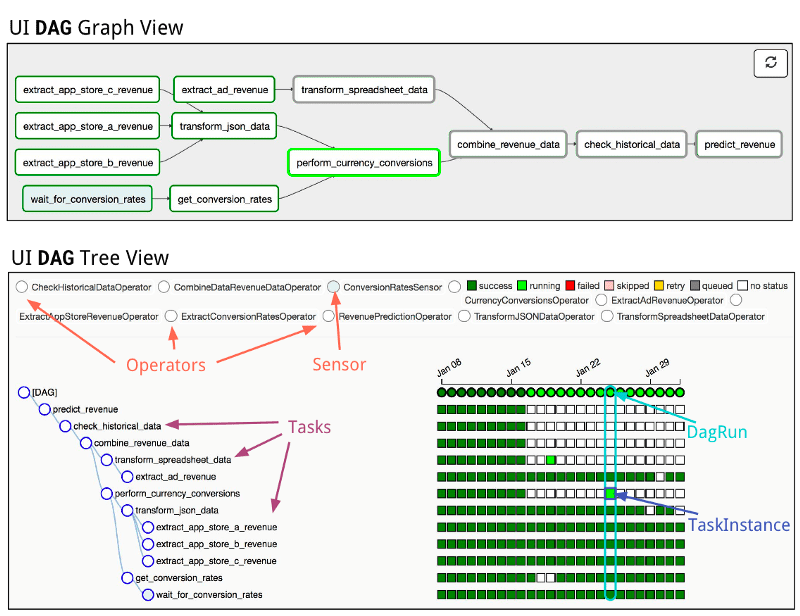

<h1 align="center">Основные понятия</h1>

### Основные компоненты Airflow

 
<small>Схема основных компонентов Airflow</small>

- **Webserver** – отвечает за веб-интерфейс, который является основным инструментом работы с Airflow и позволяет пользователю визуализировать свои DAG-и (Directed Acyclic Graph) и контролировать их выполнение. Кроме того, Webserver предоставляет экспериментальный REST API, которые позволяют управлять Airflow не через веб-интерфейс, а программно.

 
<small>Веб-интерфейс Airflow</small>

 

- **Scheduler** — главный компонент в Airflow, контролирующий расписание выполнения, обновлением DAGs и запуском Tasks. оркестрирует выполнение DAG-ов, обеспечивая их запуск в нужное время и в нужном порядке.

> И **Webserver**, и **Scheduler** – это долгоживущие сервисы, то есть они поднимаются при запуске Airflow и работают постоянно.

- **Workers** – представляют собой эфемерные pod-ы. Их создает Kubernetes Executor, и они служат только для выполнения одной-единственной DAG-задачи. После того, как задача выполнена, ее Worker-pod уничтожается.

 
<small>Flow взаимодействия компонентов Airflow</small>

