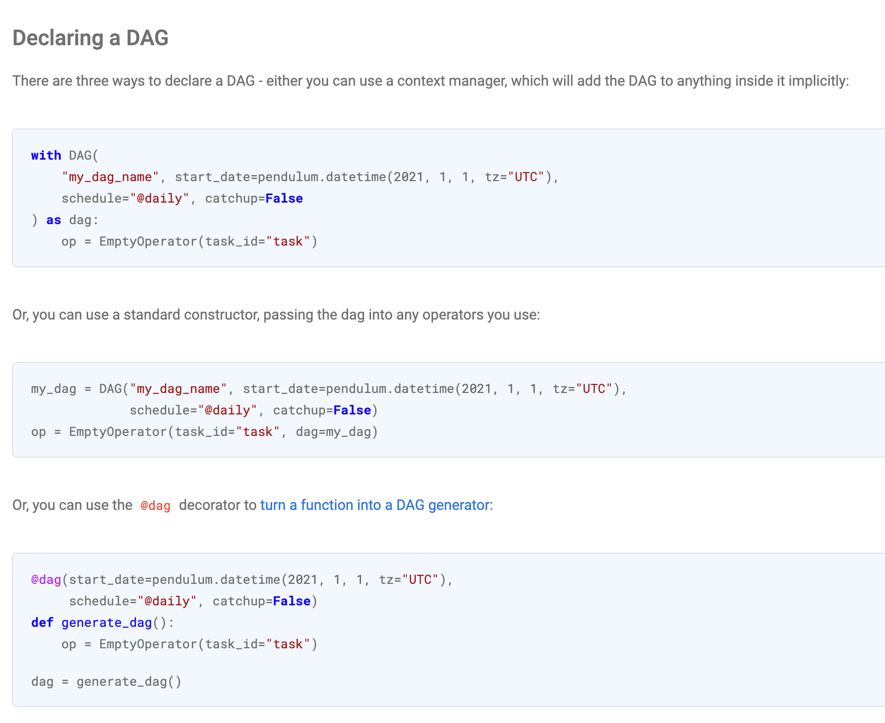
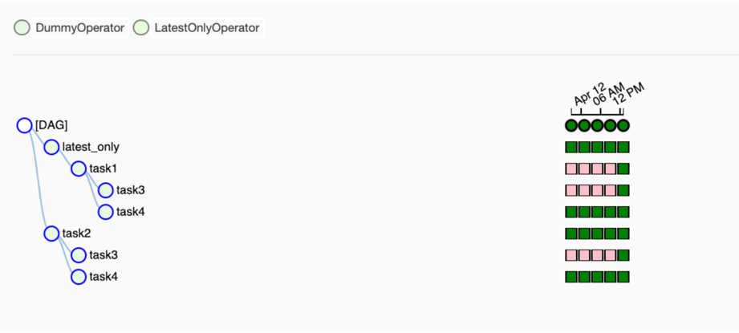

<h1 align="center">DAGs и Tasks</h1>

<br>

### DAG and Tasks
- **DAG** (направленный ациклический граф) – концептуальное представление серии действий или, другими словами, математическая абстракция конвейера данных (data pipeline).

  Простыми словами это некий "контейнер" для взаимодействующих друг с другом Tasks. ([Подробная информация о Airflow DAGs](https://airflow.apache.org/docs/apache-airflow/stable/concepts/dags.html))

<p align="center">
</p>
<p align="center"><small>Пример DAG с простым ветвлением</small></p>

> Аббревиатура **DAG** расшифровывается так:
> 
> **DIRECTED** — направленный. В общем, если существует несколько задач (тасков), каждая из них должна иметь по крайней мере одну материнскую (предыдущую) или дочернюю (последующую) задачу. Возможно, предыдущих или последующих задач будет больше одной. (Однако важно отметить, что существуют также DAG, которые имеют несколько параллельных задач, что означает отсутствие зависимостей между параллельным задачами.)
> 
> **ACYCLIC** — ациклический. Ни одна задача не может создавать данные, которые будут ссылаться на самих себя. Это может создать проблему бесконечного цикла. В DAG нет циклов.
>
> **GRAPH** — граф. В математике граф представляет собой конечный набор узлов с вершинами, соединяющими узлы. В контексте разработки данных каждый узел в графе представляет собой задачу. Все задачи изложены в четкой структуре, с дискретными процессами, происходящими в заданных точках, и прозрачными взаимосвязями с другими задачами.

- **DAG Run** — инициализированный даг, которому присвоен свой **execution_date**. Даграны одного дага могут вполне работать параллельно.


- **Operator** — это кусочки кода, ответственные за выполнение какого-либо конкретного действия. Есть три типа операторов:

    - **action** операторы,  например самый простой BashOperator для выполнения bash-кода или PythonOperator, который может выполнить любой Python-код; 
    - **transfer** операторы, которые необходимы для перемещения данных с места на место, например, MsSqlToHiveTransfer; 
    - **sensor** операторы позволяют реагировать или притормозить дальнейшее выполнение дага до наступления какого-либо события. Простой пример, HttpSensor может дергать указанный API-эндпойнт, и когда он дождется нужного ответа, запустить оператор PythonOperator, который выполнит `print("I got the response!")`. 
    
      Вопрос: Зачем, если можно делать повторы прямо в операторе?
      
      А затем, чтобы не забивать пул тасков подвисшими операторами. Сенсор запускается, проверяет и умирает до следующей попытки.
    
  > Также можно писать собсвенные кастомные операторы, что позволяет добавлять дополнительный кастомный функционал и интегрироваться с разными инструментами.
  > Полный список всех операторов можно найти в официальной документации:
<a href="https://airflow.apache.org/docs/apache-airflow/stable/concepts/operators.html">Список всех базовых операторов</a>

- **Task** — объявленные операторы вне зависимости от их типа и прикрепленные к дагу становятся тасками.


- **Task instance** — когда Scheduler решил, что таски пора отправлять в бой на исполнители-воркеры, он назначает им контекст (т. е. комплект переменных — параметров выполнения), разворачивает шаблоны команд или запросов и складывает их в пул.

Пример объявления **DAG'а** разными способами и **Задачи** с оператором **EmptyOperator**:

<p align="center">
<br></p>

Визуализация DAG'а в веб-интерфейсе:

<p align="center">
<br></p>


### Отношения между Tasks
Ключевой частью использования Задач является определение того, как они связаны друг с другом — их зависимость. Сначала вы объявляете свои Задачи, а затем объявляете их зависимости.

Есть два способа объявления зависимостей — с помощью операторов `>>`:

`first_task >> second_task >> [third_task, fourth_task]`

Или более явные `set_upstream` и `set_downstream` методы:

```
first_task.set_downstream(second_task)
third_task.set_upstream(second_task)
```

Они оба делают одно и то же, но рекомендуется использовать операторы `>>`, так как в большинстве случаев их легче читать.


### Запуск DAGs по расписанию
DAGs могут запускаться разными способами, по расписанию, какому-либо событию или принудительно самим пользователем, например, из UI.

Рассмотрим самый простой запуск по расписанию.
Вы можете настроить DAG для работы по простому расписанию, указав в параметре `schedule` выражение `cron`, `datetime.timedelta` объект или один из следующих «пресетов» `cron`:

<table>
<thead>
  <tr>
    <th>Preset</th>
    <th>Значение</th>
    <th>Cron синтаксис</th>
  </tr>
</thead>
<tbody>
  <tr>
    <td>None</td>
    <td>Расписание не указано, то есть DAG срабатывает не по расписанию, а извне</td>
    <td></td>
  </tr>
  <tr>
    <td>@once</td>
    <td>Запланирован только один запуск</td>
    <td></td>
  </tr>
  <tr>
    <td>@hourly</td>
    <td>Запускать раз в час в конце часа</td>
    <td>0 * * * *</td>
  </tr>
  <tr>
    <td>@daily</td>
    <td>Выполнять один раз в день в полночь (00:00)</td>
    <td>0 0 * * *</td>
  </tr>
  <tr>
    <td>@weekly</td>
    <td>Запуск раз в неделю в полночь (00:00) в воскресенье</td>
    <td>0 0 * * 0</td>
  </tr>
  <tr>
    <td>@monthly</td>
    <td>Выполняется раз в месяц в полночь (00:00) первого дня месяца</td>
    <td>0 0 1 * *</td>
  </tr>
  <tr>
    <td>@quarterly</td>
    <td>Выполняется раз в квартал в полночь (00:00) первого дня</td>
    <td>0 0 1 */3 *</td>
  </tr>
  <tr>
    <td>@yearly</td>
    <td>Выполняется один раз в год в полночь (00:00) 1 января</td>
    <td>0 0 1 1 *</td>
  </tr>
</tbody>
</table>


