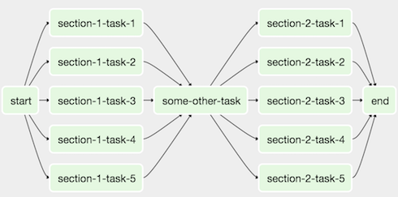
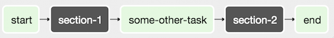

<h1 align="center">SubDAG</h1>

<br>

### SubDAG
Иногда вы можете заметить, что регулярно добавляете один и тот же набор задач в каждый **DAG** и хотите сгруппировать множество задач в одну логическую единицу. Для этого и нужны **SubDAG**.

Например, у вас есть **DAG** в котором много параллельных задач, которые логично было бы объединить в некую группу:

<p align="center">
<br></p>

Мы можем объединить все параллельные task-операторы в один **SubDAG**, чтобы результирующий **DAG** выглядел следующим образом:


<p align="center">
<br></p>


### Пример создания SubDAG

Для начала создадим новый файл `subdag.py` в котором мы объявим наш SubDAG:
```python
import pendulum

from airflow import DAG
from airflow.operators.empty import EmptyOperator


def subdag(parent_dag_name, child_dag_name, args):
    """
    Generate a DAG to be used as a subdag.

    :param str parent_dag_name: Id of the parent DAG
    :param str child_dag_name: Id of the child DAG
    :param dict args: Default arguments to provide to the subdag
    :return: DAG to use as a subdag
    :rtype: airflow.models.DAG
    """
    dag_subdag = DAG(
        dag_id=f'{parent_dag_name}.{child_dag_name}',
        default_args=args,
        start_date=pendulum.datetime(2021, 1, 1, tz="UTC"),
        catchup=False,
        schedule="@daily",
    )

    for i in range(5):
        EmptyOperator(
            task_id=f'{child_dag_name}-task-{i + 1}',
            default_args=args,
            dag=dag_subdag,
        )

    return dag_subdag
```

Затем на этот SubDAG можно ссылаться в вашем основном файле `main_dag.py`:

```python
import datetime

from airflow import DAG
from airflow.example_dags.subdags.subdag import subdag
from airflow.operators.empty import EmptyOperator
from airflow.operators.subdag import SubDagOperator

DAG_NAME = 'example_subdag_operator'

with DAG(
    dag_id=DAG_NAME,
    default_args={"retries": 2},
    start_date=datetime.datetime(2022, 1, 1),
    schedule="@once",
    tags=['example'],
) as dag:

    start = EmptyOperator(
        task_id='start',
    )

    section_1 = SubDagOperator(
        task_id='section-1',
        subdag=subdag(DAG_NAME, 'section-1', dag.default_args),
    )

    some_other_task = EmptyOperator(
        task_id='some-other-task',
    )

    section_2 = SubDagOperator(
        task_id='section-2',
        subdag=subdag(DAG_NAME, 'section-2', dag.default_args),
    )

    end = EmptyOperator(
        task_id='end',
    )

    start >> section_1 >> some_other_task >> section_2 >> end
```

Дополнительную информацию можно найти в официальной документации [SubDAG Documentation](https://airflow.apache.org/docs/apache-airflow/stable/concepts/dags.html#subdags)

