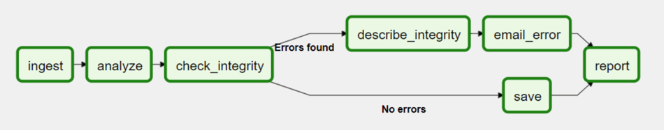

<h1 align="center">Task Group</h1>

<br>

### Task Group

**Task Group** можно использовать для организации задач в иерархические группы в графическом представлении. Это полезно для создания повторяющихся шаблонов и сокращения визуального беспорядка.

Таким образом **Task Group** предоставляет тот же функционал что и **SubGAG**. Но в чем тогда разница?


<p align="center">
<br></p>

В отличие от **SubDAG**, группы задач представляют собой исключительно визуальную группировку. Задачи в **TaskGroups** живут в том же исходном **DAG** и учитывают все настройки и конфигурации пула. Однако в интерфейсе пользователя это выглядит удобнее и красивее.


### Пример создания TaskGroup

```python
from airflow.decorators import task_group

@task_group()
def group1():
    task1 = EmptyOperator(task_id="task1")
    task2 = EmptyOperator(task_id="task2")

task3 = EmptyOperator(task_id="task3")

group1() >> task3
```

### Edge Labels (Метки связей между задачами)
Помимо группировки задач мы также можем пометить ребра зависимостей между задачами.
Это может быть особенно полезно для при ветвлении задач.

Edge Labels добавляются так же как обычные задачи, при помощи `>>`:
```python
from airflow.utils.edgemodifier import Label


with DAG(
    "example_branch_labels",
    schedule="@daily",
    start_date=pendulum.datetime(2021, 1, 1, tz="UTC"),
    catchup=False,
) as dag:
    ingest = EmptyOperator(task_id="ingest")
    analyse = EmptyOperator(task_id="analyze")
    check = EmptyOperator(task_id="check_integrity")
    describe = EmptyOperator(task_id="describe_integrity")
    error = EmptyOperator(task_id="email_error")
    save = EmptyOperator(task_id="save")
    report = EmptyOperator(task_id="report")

    ingest >> analyse >> check
    check >> Label("No errors") >> save >> report
    check >> Label("Errors found") >> describe >> error >> report
```

<p align="center">
<br></p>


### TaskGroup vs SubDAG
Мы уже разобрались что **TaskGroup** и **SubDAG** имеют один и тот же функционал. Значит нет никакой разницы использовать **TaskGroup** или **SubDAG**?

**SubDAG**, хотя и служат для той же цели, что и **TaskGroup**, однако создают как проблемы с производительность, так и функциональные проблемы из-за их подкапотной реализации:

- **SubDagOperator** запускает **BackfillJob**, который игнорирует параллелизм.


- **SubDAG** имеют свои собственные атрибуты. Если атрибуты **SubDAG** несовместимы с родительским **DAG**, может произойти непредвиденное поведение.


- визуально не очень удобно использовать **SubDAG** так как невозможно увидеть полный **DAG** со всеми его **SubDAG'ми**, поскольку вложенные **DAG** существуют как отдельные полноценные **DAG'и**.

Поэтому **TaskGroup** — лучший вариант, учитывая, что это чисто визуальные группировка задач в веб-интерфейса. Все задачи внутри **TaskGroup** по-прежнему ведут себя как любые другие задачи за пределами **TaskGroup**.

Основные различия между этими двумя конструкциями:

<table>
  <tr>
    <th>TaskGroup</th>
    <th>SubDAG</th>
  </tr>
  <tr>
    <td>Repeating patterns as part of the same DAG</td>
    <td>Repeating patterns as a separate DAG</td>
  </tr>
  <tr>
    <td>One set of views and statistics for the DAG</td>
    <td>Separate set of views and statistics between parent and child DAGs</td>
  </tr>
    <tr>
    <td>One set of DAG configuration</td>
    <td>Several sets of DAG configurations</td>
  </tr>

<tr>
    <td>Honors parallelism configurations through existing SchedulerJob</td>
    <td>Does not honor parallelism configurations due to newly spawned BackfillJob</td>
  </tr>
    <tr>
    <td>Simple construct declaration with context manager</td>
    <td>Complex DAG factory with naming restrictions</td>
  </tr>
</table>
