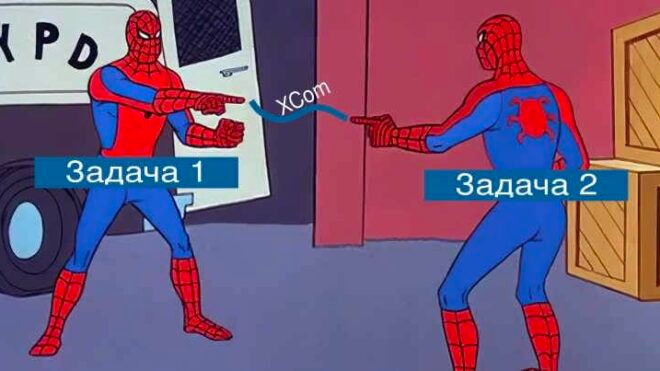

<h1 align="center">xCOM</h1>

<br>

### xCOM
**XCom**  (cross-communications) — это механизм взаимодействия между задачами. 
Задачи в Apache Airflow изолированы и могут запускаться на разных машинах, 
поэтому **XCom** является тем средством, которое позволяет им “разговаривать” 
друг с другом.


<p align="center">
<br></p>


Вкратце **xCOM** предназначен для передачи небольших данных между задачами (строки, путь к файлу, какие-либо переменные и т.д.).

> XCom предназначен для передачи **небольших данных**. Не передавайте через него данные большого размера, например, какой-нибудь DataFrame. Это объясняется тем, что XCom-данные переносятся через СУБД, например, MySQL, который ограничен 64 КБ.

XCom идентифицируются по ключу, у которого есть значение. 
Передача и прием сообщения (значение ключа) осуществляется 
через методы экземпляра задачи (task instance): `xcom_push` и `xcom_pull`. 

Допустим, что имеется 2 задачи, которые реализуют функции Python. 
Первая задача генерирует код сигнала такой, что если 0, то всё хорошо; 
все остальные значения говорят о том, что произошла ошибка. 
Вторая задача получает этот код и производит какие-то действия в ответ. 
Так вот код сигнала можно передавать по **XCom**, а задачи будут его проверять. 
Ниже на примере Python Operator показано, как это может выглядеть.


```python
from airflow import DAG 
from airflow.operators.python import PythonOperator
from airflow.utils.dates import days_ago

default_args = { "owner": "roman", }

def get_signal():https://www.bigdataschool.ru/blog/dynamic-dag-generation-in-airflow.html
    return 0

def process_signal(**kwargs):
   ti = kwargs["ti"]
   ti.xcom_push("signal", get_signal())

def result(ti):
    status = ti.xcom_pull(task_ids="check-status", key="signal")
    if status == 0:
        print("Not ok")

with DAG(
    "xcomguide",
    default_args=default_args,
    schedule_interval="daily",
    start_date=days_ago(2),
) as dag:

    check_status = PythonOperator(
        task_id="check-status",
        python_callable=process_signal
    )

    res = PythonOperator(
        task_id="result",
        python_callable=result
    )

    check_status >> res 
```

В этом примере можно заметить, что экземпляр задачи можно достать либо 
через `**kwargs`, либо первым аргументом функции. В параметре `task_ids` 
метода `xcom_pull` указывается не имя функции, которая передавала пару 
ключ-значение, а идентификатор задачи.
