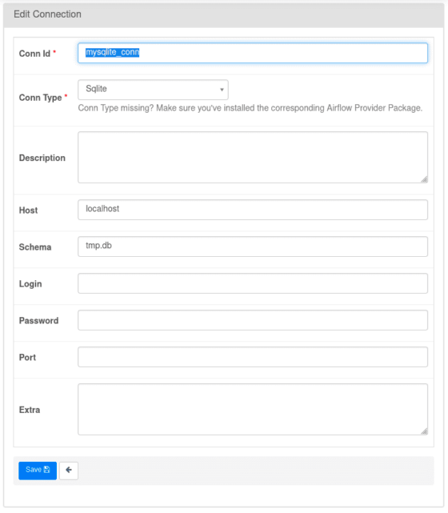

<h1 align="center">Connections & Hooks</h1>

<br>

### Connections

**Airflow** часто используется для извлечения и передачи данных в другие 
системы, поэтому он имеет **Connection** для 
хранения учетных данных, которые используются для связи с внешними системами.

Connections (соединения) – это набор параметров (логин, пароль, хост) и 
некая внешняя система c уникальным именем (**conn_id**), к которой и 
происходит подключение. Такой системой может быть базы и хранилища 
данных, электронная почта, AWS, Google Cloud, Telegram и т.д. 
Всякий раз, когда вам нужно изнутри **Airflow** подключиться к БД, то 
будут использоваться соединения и хуки.


Список соединений доступен в пользовательском интерфейсе во вкладке 
**Admin->Connection**. Там же можно добавить новое соединение.

<p align="center">
<br></p>
<p align="center"><small>Пример конфигурации соединения с MySQL</small></p>

### Hook

Hook предоставляет интерфейс для взаимодействия с внешней системой в пределах 
одного **DAG'а**. Например, некоторые задачи требуют доступа к **MySQL**, и чтобы не 
устанавливать связь каждый раз в нужной задаче, можно использовать **Хук**. 
Хуки также позволяют не хранить параметры аутентификации в **DAG'е**.

Например хук соединения **SQLite** импортируется и реализуется следующим образом:

```Python
from airflow.providers.sqlite.hooks.sqlite import SqliteHook


sqlite_hook = SqliteHook(sqlite_conn_id='sqlite_conn')
```

### Пример простого DAG для записи данных в БД

```python
from airflow import DAG
from airflow.utils.dates import days_ago
from airflow.operators.python import PythonOperator
from airflow.providers.sqlite.operators.sqlite import SqliteOperator
from airflow.providers.sqlite.hooks.sqlite import SqliteHook


def insert(**kwargs):
    exec_time = kwargs['ts']
    sqlite_hook = SqliteHook(sqlite_conn_id='sqlite_conn')
    rows = [(1,  exec_time),]
    fields = ['id', 'exec_time']
    sqlite_hook.insert_rows(
        table='example',
        rows=rows,
        target_fields=fields,
    )
with DAG(
    'conhook',
    schedule_interval=None,
    start_date=days_ago(2),
) as dag:
    insert_into_example = PythonOperator(
        task_id='insert_into_example',
        python_callable=insert,
    )
    print_rows = SqliteOperator(
        task_id='print_rows',
        sqlite_conn_id='sqlite_conn',
        sql='SELECT id, exec_time from example'
    )
    
    insert_into_example >> print_rows
```

Также можно выполнить SQL запрос самостоятельно через метод `run`, например так:


```Python
sql = """
INSERT INTO example (id, exec_time)
values (%d, "%s")
"""

sqlite_hook = SqliteHook(sqlite_conn_id='sqlite_conn')
sqlite_hook.run(sql % (0, exec_time))
```
